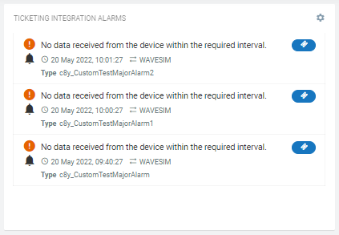

For Cumulocity IoT version >= 10.16 and Application Builder version >= 2.0.0, please refer to https://github.com/SoftwareAG/c8y-ticketing-integration-plugin

# Ticketing Integration Alarms Widget for Cumulocity IoT

This widget is dependent on Cumulocity IoT Ticketing Integration microservice. It shows active alarms related to a device and allows to create tickets in the Ticketing platform.

### Installation - for the dashboards using Runtime Widget Loader
1. Download the latest `c8y-ticketing-integration-alarms-widget-{version}.zip` file from the Releases section.
2. Make sure you have Application Builder app installed.
3. Open a dashboard.
4. Click `more...`.
5. Select `Install Widget` and follow the instructions.

### Configuration - to add the widget on dashboard
1. Make sure you have successfully installed the widget.
2. Click on `Add widget`.
3. Choose `Ticket Integration Alarms` widget.
4. `Title` is the title of widget. Provide a relevant name. You may choose to hide this. Go to `Appearance` tab and choose `Hidden` under `Widget header style`.
5. Choose a device using `Target assets or devices` for which you want to see the active alarms. It shows maximum 50 alarms at the moment.
6. Click `Save` to add the widget on the dashboard.
7. In case you see unexpected results on the widget, refer to browser console to see if there are error logs.

### Usage - to use the widget
1. Once widget is added to the dashboards, it lists all the active alarms related to a device.
2. On hovering an alarm, there can be 3 buttons
    1. Green button to CLEAR an alarm.
    2. Orange button to ACKNOWLDGE an alarm.
    3. Blue button to CREATE A TICKET for an alarm.
        1. It is only available if there is no ticket already created for an alarm.
        2. Clicking this button will show a pop-up which allows you to write an additional description about an alarm before you create a ticket.
3. If there is already a ticket related to an alarm, ticket id is shown. Clicking the ticket id will redirect you to the ticket record in Ticketing platform in a new browser tab.

### Development - to do the enhancements and testing locally
1. Clone the repository on local machine using `git clone https://github.com/SoftwareAG/c8y-ticketing-integration-alarms-widget.git`.
2. Run `npm install` to download the module dependencies.
3. Install c8ycli `npm install -g @c8y/cli` if not already.
4. Run `c8ycli server -u https://your_tenant_url` to start the server.
5. Go to `http://localhost:9000/apps/cockpit/` in the browser to view and test your changes.
6. (Optional) push the changes back to this repository.

### Build - to create a new build for the Runtime Widget Loader
1. Finish the development and testing on your local machine.
2. Run `gulp` to start the build process. Run `npm install -g gulp` to install gulp if not already.
3. Use `c8y-ticketing-integration-alarms-widget-{version}.zip` file in the `dist` folder as a distribution.

------------------------------

These tools are provided as-is and without warranty or support. They do not constitute part of the Software AG product suite. Users are free to use, fork and modify them, subject to the license agreement. While Software AG welcomes contributions, we cannot guarantee to include every contribution in the master project.

------------------------------

For more information you can Ask a Question in the [TECHcommunity Forums](https://tech.forums.softwareag.com/tags/c/forum/1/Cumulocity-IoT).
  
  
You can find additional information in the [Software AG TECHcommunity](https://tech.forums.softwareag.com/tag/Cumulocity-IoT).
